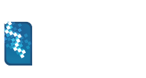
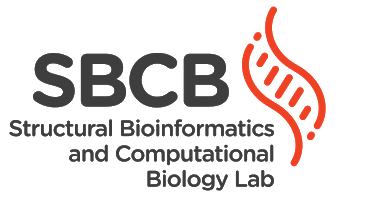

# ***ConfID***: an analytical method for conformational characterization of small molecules using molecular dynamics trajectories


Welcome to ***ConfID***!

Conformational generation is a recurrent challenge in early phases of drug design, mostly due to the task of making sense between the number of conformers generated and their relevance for biological purposes. 

In this sense, ***ConfID***, a Python-based computational tool, was designed to identify and characterize conformational populations of drug-like molecules sampled through molecular dynamics simulations. 

By using molecular dynamics (MD) simulations (and assuming accurate parameters are used), ***ConfID*** can identify all conformational populations sampled in the presence of solvent and quantify their relative abundance, while harnessing the benefits of MD and calculating time-dependent properties of each conformational population identified.

- ***ConfID*** homepage: http://sbcb.inf.ufrgs.br/confid
- For installation instructions, please read [INSTALL.md](INSTALL.md).
- To download ***ConfID*** from snapcraft: https://snapcraft.io/confid
- For usage and configuration instructions, please read the ***ConfID*** manual.
- For tutorials please read [TUTORIAL.md](TUTORIAL.md).

<iframe src="https://snapcraft.io/confid/embedded?button=white&summary=true" frameborder="0" width="100%" height="360px" style="border: 1px solid #CCC; border-radius: 2px;"></iframe>

Have a nice "_ConfIDent_" analysis! =)

## What is ***ConfID***?

It is a Python-based computational tool designed to identify and characterize conformational populations of small molecules sampled through molecular dynamics simulations.

ConfID was developed by:

- [Bruno I. Grisci](https://orcid.org/0000-0003-4083-5881) - PhD student (Institute of Informatics - UFRGS)
- [Marcelo D. Polêto](https://orcid.org/0000-0001-9210-690X) - Postdoctoral Researcher (General Biology Department - UFV)
- [Marcio Dorn](https://orcid.org/0000-0001-8534-3480) - Adjunct Professor (Institute of Informatics - UFRGS)
- [Hugo Verli](https://orcid.org/0000-0002-4796-8620) - Associate Professor (Center of Biotechnology - UFRGS) 

## To which problems ***ConfID*** was designed for?

Genetic algorithms and knowledge-based approaches have been employed to study molecular flexibility. However, these methods are usually based on crystallographic information, and their calculations are made in vacuum or with implicit solvent and do not take into account the influence of explicit solvent molecules on conformational preferences. 

By using MD simulations (and assuming accurate parameters are used), ***ConfID*** can identify all conformational populations sampled in the presence of solvent and quantify their relative abundance, while harnessing the benefits of MD and calculating time-dependent properties of each conformational population.


## Tutorials

a) [Two analogue ligands in water](TUTORIAL.md)

## Frequently Asked Questions

Do you have any questions? Take a look on our [FAQ](FAQ.md)!

## Publications

There are some papers already using ***ConfID***! These are some:

- Pablo R. Arantes, Marcelo D. Polêto, Elisa B. O. John, Conrado Pedebos, Bruno I. Grisci, Marcio Dorn, and Hugo Verli. _Development of GROMOS-Compatible Parameter Set for Simulations of Chalcones and Flavonoids_, The Journal of Physical Chemistry B **2019** 123 (5), 994-1008, DOI: [10.1021/acs.jpcb.8b10139](https://doi.org/10.1021/acs.jpcb.8b10139)

- Roberta Tesch, Christian Becker, Matthias P. Müller, Michael E. Beck, Lena Quambusch, Matthäus Getlik, Jonas Lategahn, Niklas Uhlenbrock, Fanny N. Costa, Marcelo D. Polêto, Pedro S.M. Pinheiro, Daniel A. Rodrigues, Carlos M.R. Sant'Anna, Fabio F. Ferreira, Hugo Verli, Carlos A.M. Fraga, Daniel Rauh. _An Unusual Intramolecular Halogen Bond Guides Conformational Selection_, Angew. Chem. Int. Ed. **2018**, 57, 9970, DOI: [10.1002/anie.201804917](https://doi.org/10.1002/anie.201804917)

## Citing ***ConfID***

If you use ***ConfID*** in a scientific publication, we would appreciate citations to the following paper:

Marcelo D. Polêto, Bruno I. Grisci, Marcio Dorn, Hugo Verli. _ConfID: an analytical method for conformational characterization of small molecules using molecular dynamics trajectories_, Bioinformatics. 2019, Volume X, Issue X, Pages XXXX-XXXX, doi (in submission)

Bibtex entry:
```
@article{confid,
  title={},
  author={},
  journal={},
  volume={},
  pages={},
  year={},
  publisher={}
}
```

***ConfID*** is registered at _Instituto Nacional da Propriedade Industrial (INPI)_ under the number BR512019001928-8 and is freely available under the license [LGPL-3.0](LICENSE.md).

## Contact information

Marcelo D. Polêto, Bruno Iochins Grisci, Marcio Dorn, Hugo Verli

- Centro de Biotecnologia, Universidade Federal do Rio Grande do Sul, Porto Alegre, RS, Brazil
- Institute of Informatics, Federal University of Rio Grande do Sul, Porto Alegre, RS, Brazil
- Departamento de Biologia Geral, Universidade Federal de Viçosa, Viçosa, MG, Brazil

E-mail: marcelo.poleto@ufv.br / bigrisci@inf.ufrgs.br

http://sbcb.inf.ufrgs.br/confid

    